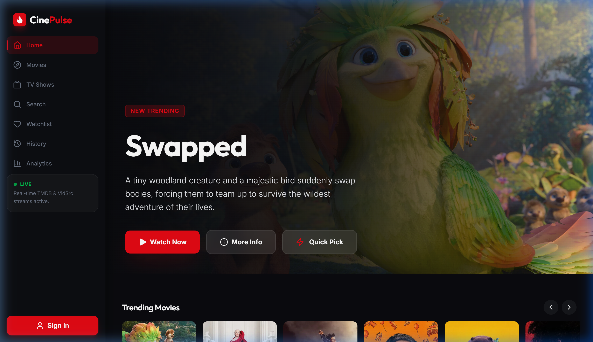
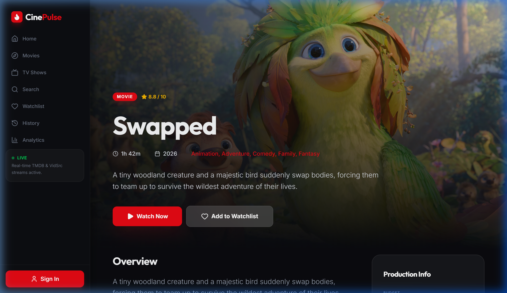
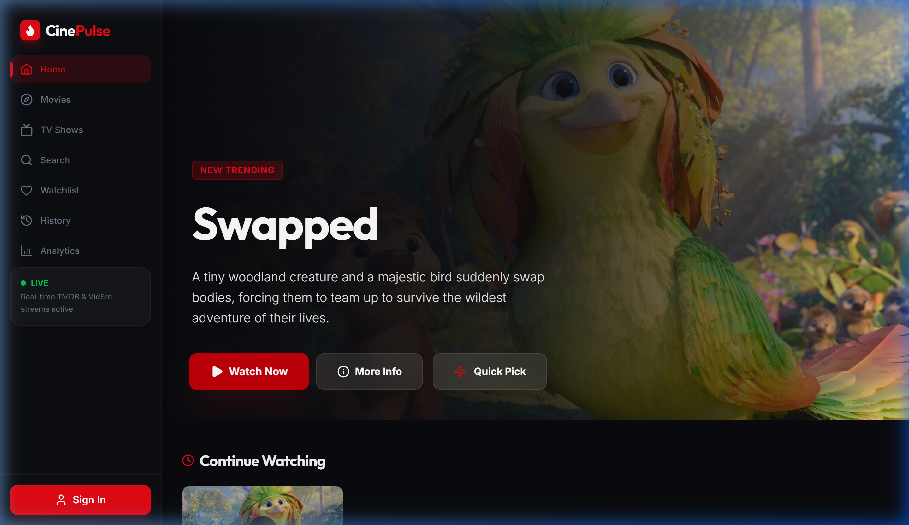
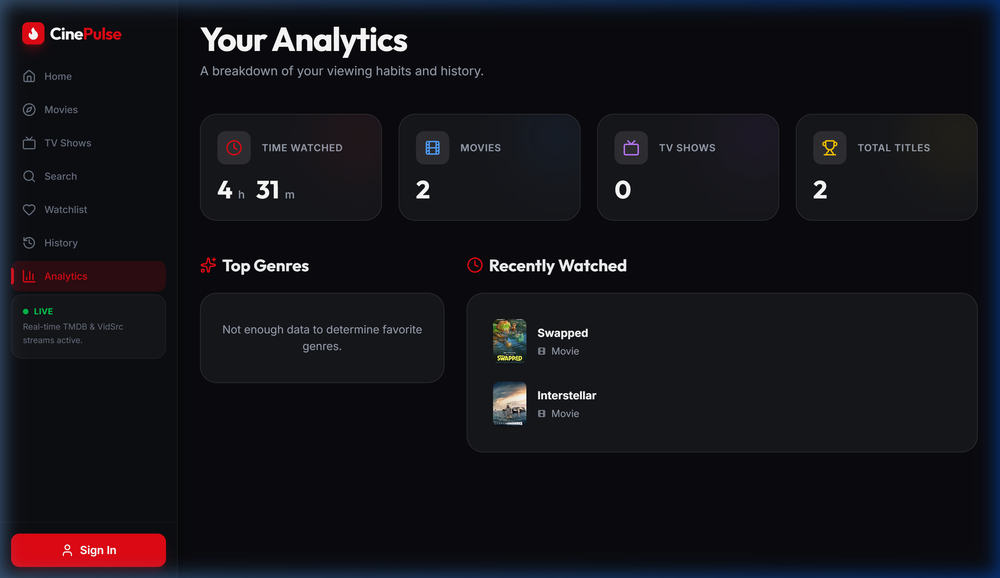

# 🍿 CinePulse

**CinePulse** is a premium, high-performance streaming discovery platform designed for an immersive cinematic experience. Built with a sleek, dark-mode glassmorphic aesthetic, it offers seamless exploration and viewing of movies and TV shows across all devices.

## 📸 Preview

| Home Dashboard | Movie Discovery |
| :---: | :---: |
|  |  |

| Cinematic Player | Personal Analytics |
| :---: | :---: |
|  |  |

## ✨ Key Features

- **Premium UI/UX**: Stunning dark mode design with fluid micro-animations powered by `motion/react`.
- **Intelligent Discovery**: Mood-based "Decision Mode" and "Quick Pick" to eliminate decision fatigue.
- **Unified Watchlist**: Synchronized tracking for movies and TV shows with progress persistence.
- **Deep Analytics**: Visualize your viewing habits, favorite genres, and total watch time on a dedicated dashboard.
- **Native Player**: Integrated streaming experience with episode selection and high-quality playback.
- **Fully Responsive**: Optimized for mobile, tablet, and desktop with a native-app feel.

## 🚀 Tech Stack

- **Frontend**: React 19 (Vite), Tailwind CSS 4
- **State/Auth**: Context API, Firebase (Optional)
- **Animations**: motion/react (Framer Motion)
- **Icons**: Lucide React
- **API**: TMDB (The Movie Database)
- **Backend**: Express (Vite Middleware Proxy)

## 🛠️ Getting Started

### Prerequisites
- Node.js (v18 or higher)
- A TMDB API Key

### Installation

1. **Clone the repository**
   ```bash
   git clone https://github.com/yourusername/cinepulse.git
   cd cinepulse
   ```

2. **Install dependencies**
   ```bash
   npm install
   ```

3. **Environment Setup**
   Create a `.env` file in the root directory:
   ```env
   TMDB_API_KEY=your_tmdb_api_key_here
   ```

4. **Start the Development Server**
   ```bash
   npm run dev
   ```
   The application will start on `http://localhost:3000`. You can also access it on your local network to test on mobile devices.

## 📱 Mobile Preview
CinePulse is built with a mobile-first mindset. The sidebar transitions into a bottom-drawer or hamburger menu on smaller screens, ensuring a consistent premium experience.

## 📝 License
This project is licensed under the MIT License.

---
*Built with ❤️ for movie lovers everywhere.*
